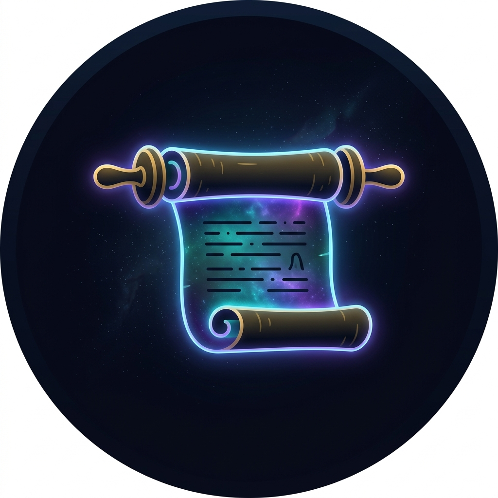

<div align="center">
  
  <h1>Papyrus</h1>
  <p>Animated wallpaper picker for Pop!_OS COSMIC</p>

  
  
  
  
</div>

---

Papyrus is a free, open-source animated wallpaper manager for Pop!_OS COSMIC. Pick a video, click it, and it becomes your live wallpaper — no accounts, no telemetry, no Wallpaper Engine required.

It also automatically extracts the dominant color from your wallpaper and applies it as your COSMIC accent color, so your entire desktop theme matches your wallpaper vibe.

## Features

- 🎬 **Animated wallpapers** — supports MP4, WebM, MKV, AVI, MOV
- 🎨 **Auto-theme** — extracts accent color from wallpaper and applies it to COSMIC
- 🌙 **Auto dark/light mode** — detects wallpaper brightness and switches accordingly
- 📁 **Multi-folder support** — add as many wallpaper folders as you want
- 🖼️ **Thumbnail previews** — auto-generated from your video files
- 🔁 **Start on login** — one toggle to persist your wallpaper across reboots
- 🚫 **No telemetry, no accounts, no cloud** — config is a plain JSON file

## Screenshots

> *Coming soon*

## Requirements

- Pop!_OS 24.04 with COSMIC desktop
- `mpvpaper` (see install instructions)
- `ffmpeg`
- Python 3.10+
- `python3-gi`, GTK4, libadwaita

## Installation

### Quick install (recommended)

```bash
curl -fsSL https://raw.githubusercontent.com/PSGtatitos/papyrus/main/install.sh | bash
```

### Manual install

**1. Install system dependencies**

```bash
sudo apt install python3-gi gir1.2-gtk-4.0 gir1.2-adw-1 ffmpeg
pip install pillow --break-system-packages
```

**2. Install mpvpaper from source**

```bash
sudo apt install git meson ninja-build libmpv-dev wayland-protocols libwayland-dev
git clone --single-branch https://github.com/GhostNaN/mpvpaper
cd mpvpaper
meson setup build --prefix=/usr/local
ninja -C build
sudo ninja -C build install
cd ..
```

**3. Install Papyrus**

```bash
git clone https://github.com/PSGtatitos/papyrus
cd papyrus
chmod +x install.sh
./install.sh
```

## Usage

Launch Papyrus from your app launcher or run:

```bash
papyrus
```

- **Click** any thumbnail to set it as your wallpaper
- **Add folder** button (top left) to add a folder of video files
- **Auto-theme DE** toggle to enable/disable automatic COSMIC theming
- **Start on login** toggle to persist wallpaper across reboots
- **Stop** button (top right) to remove the wallpaper

## Where to find animated wallpapers

- [MoeWalls](https://moewalls.com) — anime/gaming, optimized WebM/MP4
- [MotionBGs](https://motionbgs.com) — 8,000+ wallpapers in 4K
- [Wallsflow](https://wallsflow.com) — growing collection, free
- [Pexels Videos](https://pexels.com/videos) — cinematic/nature, 4K

## How it works

Papyrus uses [mpvpaper](https://github.com/GhostNaN/mpvpaper) to render video files as Wayland layer surfaces behind your desktop. When you select a wallpaper, Papyrus:

1. Kills any running mpvpaper instance
2. Starts mpvpaper with loop enabled on your display output
3. Extracts the most vibrant pixel from the video thumbnail
4. Writes the color to COSMIC's compiled theme config files
5. COSMIC picks up the file changes and updates the accent color

## Auto-theming

When Auto-theme DE is enabled, Papyrus writes directly to:

```
~/.config/cosmic/com.system76.CosmicTheme.Dark/v1/accent
~/.config/cosmic/com.system76.CosmicTheme.Dark/v1/background
~/.config/cosmic/com.system76.CosmicTheme.Mode/v1/is_dark
```

No restart required — COSMIC watches these files and applies changes live.

## Config

Config is stored at `~/.config/papyrus/config.json`:

```json
{
  "current": "/home/user/Downloads/my-wallpaper.mp4",
  "dirs": ["/home/user/Downloads", "/home/user/Videos"],
  "output": "HDMI-A-1",
  "auto_theme": true
}
```

## Contributing

Pull requests are welcome. For major changes, open an issue first.

## License

[GPL-3.0](LICENSE) — same license as mpvpaper.

---

<div align="center">
  Made with ❤️ for the COSMIC desktop community
</div>
